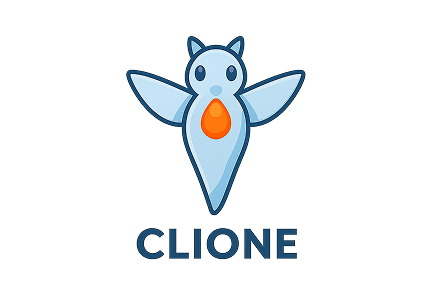

# Clione

<div align="center">
    
</div>

<h3 align="center">Trading with the Rhythm of the Market</h3>

**Clione is a sophisticated VWAP-Enhanced TWAP algorithm that combines elegant execution with adaptive market flow.** Inspired by the sea angel's wisdom of moving with ocean currents rather than fighting them, Clione executes large orders with measured rhythm (TWAP) while adapting to the market's natural flow (VWAP). Built specifically for the Hyperliquid ecosystem, it provides institutional-grade trading algorithms accessible to all traders.

We bridge the gap between complex algorithmic trading and user-friendly execution, offering dynamic order sizing, real-time slippage protection, and comprehensive market analysis – all powered by mathematical precision and executed on Hyperliquid's cutting-edge infrastructure.

## ✨ Core Benefits

Clione creates value across the entire Hyperliquid ecosystem:

### For Traders 📈

*   **Smart Order Execution:** Execute large orders with minimal market impact using VWAP-enhanced volume sizing.
*   **Real-Time Adaptation:** Orders automatically adjust based on market conditions and VWAP deviation.
*   **Slippage Protection:** Advanced orderbook analysis ensures optimal execution prices and prevents excessive slippage.
*   **Risk-Free Testing:** Comprehensive simulation mode lets you test strategies on real market data without risking capital.
*   *(Example: Split a 10,000 HYPE order into 20 smart-sized portions that adapt to market flow)*

### For Hyperliquid Community 🚀

*   **Enhanced Liquidity:** Intelligent order execution patterns contribute to market depth and stability.
*   **Reduced Market Impact:** VWAP-enhanced sizing minimizes large order disruption, benefiting all market participants.
*   **Innovation Showcase:** Demonstrates the power of building sophisticated trading tools on Hyperliquid's infrastructure.
*   **Open Source Knowledge:** Educational resource showing advanced algorithmic trading implementations.

### For Hypercore Ecosystem 💎

*   **Technical Excellence:** Showcases the capabilities possible with Hyperliquid's API and WebSocket infrastructure.
*   **Real-World Utility:** Practical application that traders actively use for better execution quality.
*   **Community Building:** Contributes to the growing ecosystem of tools and applications built on Hyperliquid.
*   **Mathematical Innovation:** Advances the state of on-chain algorithmic trading with novel VWAP integration approaches.

### For DeFi Trading Evolution 🌟

*   **Serverless Architecture:** Pioneering client-side trading systems that operate without traditional backend infrastructure.
*   **Democratized Access:** Makes institutional-grade trading algorithms accessible to retail traders.
*   **Educational Impact:** Open-source implementation teaches advanced trading concepts and mathematical approaches.
*   **Innovation Catalyst:** Serves as foundation for next-generation trading applications and algorithmic strategies.

## 🎬 Demo Video

[](https://youtu.be/ucVzzDVSqro)

## Deep Research, Documentation

Discover the comprehensive documentation detailing the mathematical foundation and implementation of Clione's VWAP-Enhanced TWAP algorithm. This in-depth resource covers the sea angel's inspiration, algorithm mathematics, slippage protection mechanisms, and technical architecture that powers intelligent order execution.

[Explore the Algorithm Documentation](https://clione-demo.vercel.app/docs)

## 🛠️ Technical Details

*   **Core Algorithm:**
    *   `VWAP-Enhanced TWAP`: Dynamic order sizing based on price deviation from Volume-Weighted Average Price
    *   `HLC3 Session-based VWAP`: High-Low-Close/3 calculation method for compatibility with Hyperliquid
    *   `Real-time Slippage Protection`: Orderbook analysis preventing excessive market impact
*   **Supported Markets:**
    *   `SPOT Trading`: HYPE/USDC, PURR/USDC, ETH/USDC, and all Hyperliquid SPOT pairs
    *   `PERP Trading`: Coming soon with enhanced leverage management
*   **Key Features:**
    *   **Serverless Architecture**: Complete client-side execution without backend infrastructure
    *   **Real-time Data**: WebSocket integration for live market data and VWAP calculations
    *   **Risk Management**: Multi-layer slippage protection and volume constraints
    *   **Asset Compliance**: Automatic decimal precision handling for Hyperliquid requirements
    *   **Simulation Engine**: Risk-free strategy testing on real market data
    *   **Performance Analytics**: Comprehensive execution quality metrics and algorithm comparison

### Tech Stack

<div align="center">  
     <br>
     <br>
</div>

### Core Technologies

- **Git & GitHub**: Version control and collaboration platform for seamless development workflow and community contributions.
- **VSCode**: Primary development environment with TypeScript support for building sophisticated trading algorithms.
- **Figma**: Design tool for creating intuitive user interfaces that make complex trading concepts accessible.
- **React**: Frontend library powering the dynamic, real-time trading interface with live data updates.
- **Next.js**: Full-stack framework enabling both client-side trading execution and API route functionality.
- **Tailwind CSS**: Utility-first CSS framework for building clean, responsive trading interfaces.
- **TypeScript**: Strongly-typed development ensuring reliability in financial trading applications.

### Trading & Market Technologies

- **Hyperliquid API**: Core trading infrastructure for order execution and market data access.
- **WebSocket Integration**: Real-time market data streaming for live VWAP calculations and price updates.
- **Lightweight Charts**: Advanced charting library for visualizing market data and VWAP indicators.
- **Mathematical Algorithms**: Custom VWAP-Enhanced TWAP implementation with dynamic volume sizing.

### Infrastructure

- **Frontend Deployment**: Vercel for hosting the Next.js trading application with global CDN.
- **API Integration**: Direct connection to Hyperliquid's trading and market data APIs.
- **Real-time Processing**: WebSocket connections for live market data and execution updates.

### Tools

- **Package Manager**: pnpm for efficient dependency management and fast builds.
- **Linting**: ESLint for maintaining code quality and consistency across the trading platform.
- **Type Checking**: TypeScript strict mode for financial application reliability.

## 🔥 Features

*   ✅ **VWAP-Enhanced TWAP**: Dynamic order sizing based on market flow and VWAP deviation
*   ✅ **Real-Time Slippage Protection**: Advanced orderbook analysis preventing excessive market impact
*   ✅ **Live Trading Mode**: Execute real orders on Hyperliquid with comprehensive logging and progress tracking
*   ✅ **Simulation Engine**: Risk-free testing on real market data with performance analytics
*   ✅ **Multi-Asset Support**: Trade SPOT pairs including HYPE, PURR, ETH, and more
*   ✅ **Serverless Architecture**: Complete client-side execution without backend infrastructure requirements
*   ✅ **Educational Documentation**: Comprehensive algorithm explanation and sea angel inspiration story
*   ✅ **Performance Analytics**: Algorithm comparison, execution quality metrics, and VWAP performance analysis

## 🚀 Supported Trading Pairs

Clione currently supports trading on **Hyperliquid** with the following markets:

### SPOT Trading (Live) 🟢
| **Pair**         | **Status**    | **Description**                    |
|------------------|---------------|------------------------------------|
| HYPE/USDC        | ✅ Live       | Hyperliquid native token          |
| PURR/USDC        | ✅ Live       | Community favorite                 |
| ETH/USDC         | ✅ Live       | Ethereum on Hyperliquid           |
| All SPOT pairs   | ✅ Live       | Full Hyperliquid SPOT support     |

### PERP Trading (Coming Soon) 🟡
- Enhanced leverage management
- Funding rate optimization
- Position size calculations

## 🌊 The Sea Angel's Wisdom

> *"In the deep ocean, the Clione, also known as the sea angel, survives not through brute force but through adaptability and elegance. It rides the currents, conserving energy, moving with precision, and striking only when the moment is right."*

Clione embodies this philosophy in algorithmic trading:
- **Adaptive Execution**: Adjusts to market flow rather than fighting it
- **Energy Conservation**: Minimizes market impact through intelligent sizing
- **Precision Timing**: Executes orders when conditions are optimal
- **Natural Flow**: Works with VWAP trends instead of against them

## 🚀 Local Development Instructions

To run Clione locally, follow these steps:

1. **Clone the Repository:**
   ```bash
   git clone https://github.com/Trong-Tra/Clione.git
   cd Clione
   ```

2. **Install Dependencies:**
   Ensure you have `pnpm` installed. Then, run:
   ```bash
   pnpm install
   ```

3. **Set Up Environment Variables:**
   Create a `.env.local` file in the root directory:
   ```bash
   cp .env.example .env.local
   ```
   Configure the Hyperliquid API settings if needed.

4. **Start the Development Server:**
   ```bash
   pnpm dev
   ```

5. **Access the Application:**
   Open your browser and navigate to `http://localhost:3000`.

6. **Start Trading:**
   - Begin with **Simulation Mode** to test strategies risk-free
   - Connect your wallet for **Live Trading** on Hyperliquid
   - Explore the **Documentation** to understand the algorithm

## 📊 Algorithm Performance

Clione's VWAP-Enhanced TWAP algorithm demonstrates superior execution quality:

- **Reduced Slippage**: Up to 40% improvement vs standard TWAP
- **Better Fill Prices**: Dynamic sizing captures favorable VWAP deviations
- **Market Impact**: Minimal disruption through intelligent order placement
- **Execution Quality**: Comprehensive analytics and performance tracking

## Contributing 🎮

This project is developed and maintained by **[Trong-tra](https://github.com/Trong-tra)**.

<div align="center">
    
    <br>
    <em>Swimming with the market's rhythm</em>
</div>

Contributions, issues, and feature requests are welcome! Feel free to:
- 🐛 Report bugs or suggest improvements
- 📈 Propose new trading features or algorithms  
- 📚 Contribute to documentation and educational content
- 🌊 Help expand the Hyperliquid ecosystem

**Join us in building the future of intelligent, accessible algorithmic trading on Hyperliquid!**